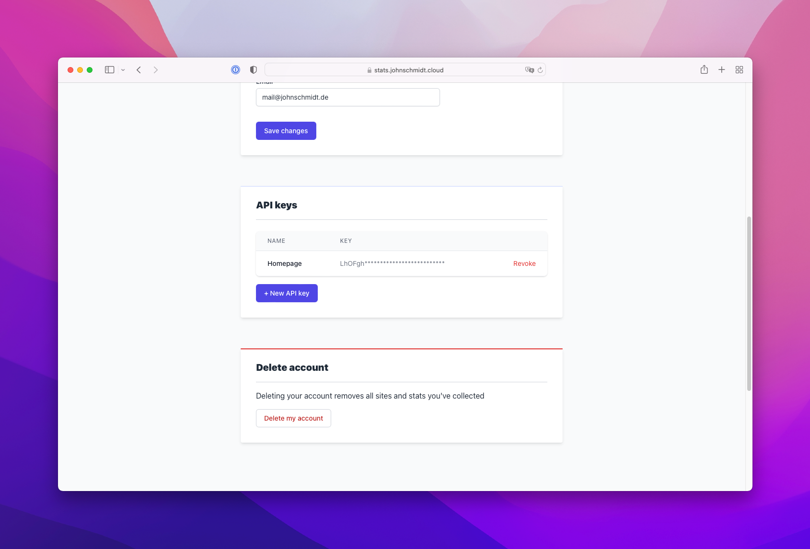
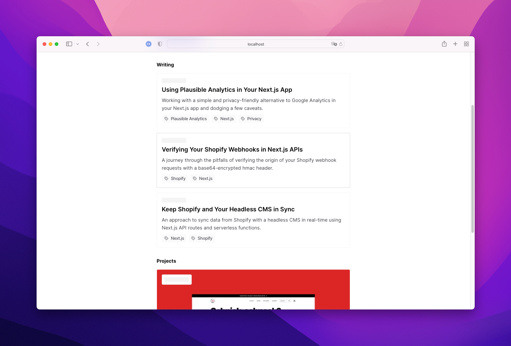

Whilst rebuilding my personal homepage, I wanted to implement a simple view counter for my posts. I've seen this a few times on popular blogs (e.g. [Lee Robinson](https://leerob.io/)) and thought it would be a nice thing to build.

Usually, these kinds of view counters involve some kind of database-API setup. Hence, I thought of multiple possibilities such as [PlanetScale](https://planetscale.com/), [Upstash](https://upstash.com/) or even a more custom approach with [Prisma](https://www.prisma.io/) and some kind of self-hosted database. I do have an own VPS running in Germany, which currently only homes my self-hosted [Plausible Analytics](https://plausible.io/) instance.

## Using Plausible Analytics to retrieve the data

This was when I realized that my Analytics instance already has all the data I need. I just needed to _retrieve_ the data to display. Plausible recently [released an API](https://plausible.io/docs/stats-api) - allowing us to perform the intended. So let's get right to it.

### Creating an API token in Plausible

To work with our API, we first need to create an API token in our Plausible Analytics dashboard. You can find the corresponding option in your user settings.



### Setting up an API route

First, I created an [API route](https://nextjs.org/docs/api-routes/introduction) in my Next.js project. I wanted to retrieve the data according to the individual and unique post slug. Thus, the API retrieves its parameter via the URL: `/api/views/[slug].ts`. A first draft of the API route is shown below.

```typescript
const viewsHandler = async (req: NextApiRequest, res: NextApiResponse) => {
  // Retrieve the slug from the query parameters
  const { slug } = req.query
  // If no slug is provided, return a 400
  if (!slug) {
    return res.status(400).message("Bad request")
  }
  // Handle the API request and return the data
  // ...
}

export default viewsHandler

```

### Retrieving the data

Now we can fetch our data from the Plausible API. We need to send a `GET` request to our API endpoint and query for the needed information. We are going for the `/api/v1/stats/aggregate` endpoint because we want to cumulate a set of data (in our case, the views) into one value. The API needs a few parameters in the following syntax to provide us with the needed data:

`/api/v1/stats/aggregate?site_id=`_`<SITE_ID>`_`&period=`_`<PERIOD>`_`&filters=event:page==`_`<SLUG>`_

(I've marked the placeholders with a set of brackets like this: `<PLACEHOLDER>`)

Let's break this down:

- `site_id` is the site's domain name set in the Plausible dashboard. In my case, it's `johnschmidt.de`
- `period` defines a _time_ period to retrieve the data from. Here, I wanted to retrieve **all** views from the beginning. Thus, the usual periods like 6 months, 12 months or last 7 days didn't work out. Fortunately, Plausible provides us with the possibility to define a custom date range.
- `filters` offers a few methods to filter your data. In our case, I wanted to filter by the corresponding page slug. We filter by `event` and deliver the exact slug in the `page` sub-filter. [Read more on filters](https://plausible.io/docs/stats-api#filtering) in the API documentation.

### Providing the date range range

The API filter accepts a custom date range with two commas separated dates in a `YYYY-MM-DD` format. Therefore, I set my start date to the day I started using Plausible on my homepage and retrieve the current date with a bit of JavaScript slickness.

```typescript
const now = new Date()
const [nowDate] = now.toISOString().split("T")
// nowDate now yields a YYYY-MM-DD format of the current date
```

### Putting the pieces together

Now we got all the required parts and can put together our function to retrieve the all-time view count to a given page slug. 

```typescript
const fetcher = (input: RequestInfo, init?: RequestInit | undefined) =>
  fetch(input, init).then((res) => res.json())

async function getPlausibleViews(slug: string) {
  const url = `https://stats.johnschmidt.cloud/api/v1/stats/aggregate?site_id=johnschmidt.de&period=custom&date=2020-12-29,${nowDate}&filters=event:page==/post/${slug}`
  return fetcher(url, {
    headers: {
      Authorization: `Bearer ${process.env.PLAUSIBLE_API_KEY}`,
      Accept: "application/json",
    },
  })
}
```

You can see that I'm pointing the request to my personal instance of Plausible Analytics, hosted on my private VPS. If you're using Plausible's hosted solution, just replace the domain with `plausible.io`. I also set up a custom `fetcher` function to simplify the data transformation and yield the response data as serialized JSON.

> **API limits**
>
> Plausible defaults to an API rate limit of 600 requests per hour. If you're self-hosting, [there's a way](https://github.com/plausible/analytics/discussions/1573#discussioncomment-1886712) to change this limit to avoid any blocked requests. If you're on the Plausible cloud service, you'd have to contact their team.

We need to authorize the request with our API token. I'd recommend putting the key in a private environment variable and retrieve it in the function.

Debugging our request will show that the API responds with the following data (the value is based on a random request I made for one of my pages).

```json
{
  "results": {
    "visitors": {
      "value": 520
    }
  }
}
```

Now we just need to process the data, maybe clean it up a bit and put it in the  API response. Let's put it all together.

```typescript
const viewsHandler = async (req: NextApiRequest, res: NextApiResponse) => {
  const { slug } = req.query
  if (!slug) {
    return res.status(400).send("Bad request")
  }
  try {
    const data = await getPlausibleViews(String(slug))
    return res.status(200).json({
      requestedSlug: slug,
      date: now.toUTCString(),
      views: data?.results?.visitors?.value,
    })
  } catch (err) {
    console.error(err)
    return res.status(500).json({ err })
  }
}

export default viewsHandler
```

Nice, well done. Test our your new API route with some sample slugs and see if it responds with the wanted data. Let's move on and see how we can display the data on our frontend.

## Displaying the data on your frontend

You might have noticed that I am primarily using Next.js as my frontend solution. Thus, the following explanation targets a Next.js frontend. 

A simple way to display your API data and even give it the ability to update in real-time is to use a client-side query library like Vercel's `swr` or `react-query`. In this example, I'll be using `swr`.

### Create a DisplayViews component

All right, let's create a component to display our data and use the revalidation features of `swr`. You can read more about the usage of SWR on[their documentation website](https://swr.vercel.app/). We're going to use the basic useSWR hook and target our API route. We provide the slug of interest via a property.

```tsx
import { fetcher } from "lib/fetcher"
import useSWR from "swr"

type Props = {
  slug: string
}

const DisplayViews: React.FC<Props> = ({ slug }) => {
  // Fetch the data with the useSWR hook
  const { data, error } = useSWR(`/api/views/${slug}`, fetcher)
  // If there's no data and no error, display a loading state
  if (!data && !error)
    return (
      <div className="inline-block animate-pulse rounded bg-zinc-100 text-transparent dark:bg-zinc-800">
        Loading views
      </div>
    )
  // If there's data, display the data
  return (
    <div className="flex items-center">
      // Mabye place an icon here?
      <span className="tabular-nums">{data?.views} views</span>
    </div>
  )
}

export default DisplayViews

```

In the component, we're fetching the data with the useSWR hook. We can determine if there's no data and no error either that the request ist still pending. In that case, we want to display a loading state. I put together a small component with a skeleton-like loading animation using [Tailwind CSS](https://tailwindcss.com/).

If the data (or an error) arrived, we can display our final component featuring our data. Here, I am being optimistic and assume that there will be always _some_ kind of data returned from the API. I did not set up a solution if the request only yields an `error` and no data.



## Wrapping up

Done! Now you can use this component anywhere in your page to display view stats to a certain page slug. It even caches the API responses across your application. SWR offers you [enough options](https://swr.vercel.app/docs/options) to fine-tune your component. For example, you could turn off the focus revalidation and limit the revalidation to navigation events and entry visits. Happy coding!
