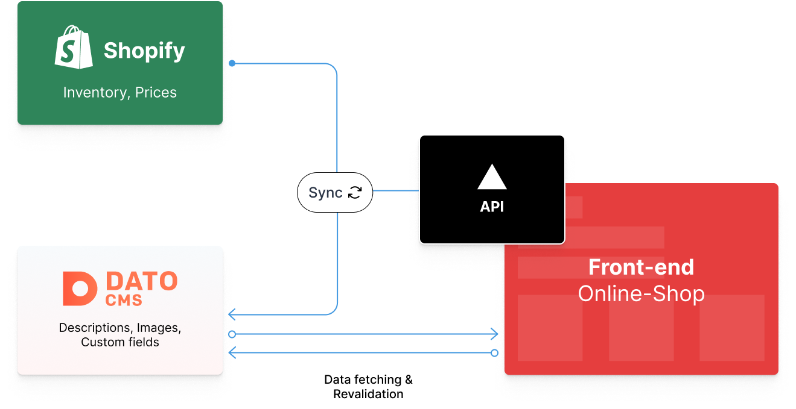
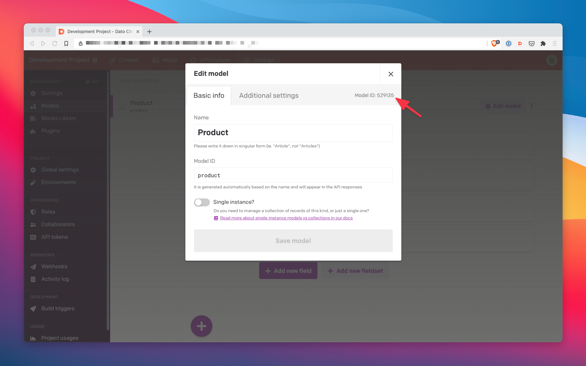

For one of my latest projects I had to figure a way to keep the data from my clients Shopify instance in sync with the headless CMS used for the rest of the content. In this project we were using [Dato CMS](https://datocms.com) as our headless CMS and [Next.js](https://nextjs.org/) as hybrid (static and server-rendered if needed) frontend. But for those of you using different products: I'd assume that you could transfer the general approach of this solution to them too.

The general idea of the content management structure was to use Shopify exclusively as the provider for the basic product data like pricing, shipping, inventory, taxes and variants. It could also provide a solid checkout solution at the end of our custom front-end flow. The content in Dato CMS builds on the basic product data and extends the possibilities. In my last project it provides additional content like nutritions, images and descriptions. It also contains all the _non e-commerce_ content of the project. I've illustrated the basic data structure of the project below.



## Prerequisites

This guide anticipates that you are working with Shopify and Dato CMS. The headless CMS might be individually exchanged if it offers some kind of content management API. In the CMS we will need a content model (sometimes referred to as type or schema) for the product to sync our Shopify data to.

## Approaching the Sync

Now if we got both of our systems ready, we'd want the products from Shopify to transfer into Dato CMS and even keep synced on changes in real-time. Luckily for us, Shopify provides a [webhook](https://shopify.dev/docs/admin-api/rest/reference/events/webhook) allowing us to receive product updates and the corresponding data in real time. We just need an endpoint for that webhook and a small piece of logic to handle the incoming data.

First, let's take a look at the data the webhook actually delivers. It depends on the type of event the webhook represents to. This is specified in a request header called `x-shopify-topic`. For us, the events of interest are `product/create`, `product/update` and `product/delete`. They represent operations in the Shopify administration. E.g., an editor hits save on an updated product and the `product/update` webhook fires. An example of the JSON data is illustrated below.

```json
{
  "id": 788032119674292922,
  "title": "Example T-Shirt",
  "body_html": null,
  "vendor": "Acme",
  "product_type": "Shirts",
  "created_at": null,
  "handle": "example-t-shirt",
  "updated_at": "2021-01-07T17:09:52-05:00",
  "published_at": "2021-01-07T17:09:52-05:00",
  "template_suffix": null,
  "status": "active",
  "published_scope": "web",
  "tags": "example, mens, t-shirt",
  "admin_graphql_api_id": "gid:\/\/shopify\/Product\/788032119674292922",
  "variants": [
    {
      "id": 642667041472713922,
      "product_id": 788032119674292922,
      "title": "",
      "price": "19.99",
      "sku": "example-shirt-s",
      "position": 0,
      // ... more variant data
    },
  ],
  "images": [
    // ... image data
  ],
  "image": null
}
```

If the event is creation or update, the webhook sends the full product data of concern in the fashion like above. On deletion, it sends a smaller body with mainly the product's `id`. Now we know what data we get from Shopify. Time set up the receiving part.

### Setting up API Routes in Next.js

Next.js provides a pretty straightforward way to implement [API routes](https://nextjs.org/docs/api-routes/introduction) in our application. For this example, we create a file like `api/sync.js`. In that file we set up the basic async API boilerplate with our `res` and `req` objects. For demonstration purposes, I will add some comments outlining our mission ahead.

```javascript
export default async (req, res) => {
  const { method, headers, body } = req
  // 0. The webhook calls from Shopify will be POST requests
  if (method === "POST") {
    // 1. Determine if the product exists in Dato CMS
    // 2. Determine the type of operation and validate it
  }
  // Catchall for invalid requests
  return res.status(400).send("Bad request")
}
```

Now let's start with the first few steps to prepare the processing of our data. We need to parse the incoming JSON data, determine if the product already exists in our Dato CMS project and determine the type of the operation.

### Determine If the Product Exists in Dato CMS

To determine if the product already exists in our Dato CMS project, we can use the Node client provided by the CMS itself. Add the `datocms-client` package to your project and construct a new client with your projects credentials.

```javascript
import { SiteClient } from "datocms-client"

// You will need a read/write API token from Dato CMS
const datocms = new SiteClient(process.env.DATOCMS_API_TOKEN)

export default async (req, res) => {
  const { method, headers, body } = req
  // 0. The webhook calls from Shopify will be POST requests
  if (method === "POST") {
    // 1. Determine if the product exists in Dato CMS
    // ...
  }
  // Catchall for invalid requests
  return res.status(400).send("Bad request")
}
```

With the clients `items.all()` method we can retrieve and filter an array of our products. To determine, if the product of concern already exists we can pass any field of the content model to our method and filter the results. In my case, I've given the product model a `productId` field, which will contain the ID coming from Shopify, to make each product uniquely distinctive. To select the correct content model for our search, we need to pass in its  model ID. It can be found in the Dato CMS administration dashboard under the models settings (image below).



Now we can pass the information we got into the client and retrieve an array of matching products.

```javascript
import { SiteClient } from "datocms-client"

// You will need a read/write API token from Dato CMS
const datocms = new SiteClient(process.env.DATOCMS_API_TOKEN)

export default async (req, res) => {
  const { method, headers, body } = req
  // 0. The webhook calls from Shopify will be POST requests
  if (method === "POST") {
    // 1. Determine if the product exists in Dato CMS
    // And we destructure the first element (if found) in the filtered array
    const [existingProduct] = await datocms.items.all({
      filter: {
        // The Model ID retrieved from Dato CMS
        type: "529135",
        fields: {
          // Filter using the product ID from the webhooks data
          productId: {
            eq: String(body.id)
          }
        }
      }
    })
    // ...
  }
  // Catchall for invalid requests
  return res.status(400).send("Bad request")
}
```

If the product exists, the `existingProduct` variable would contain the desired product. If not, it will be `undefined`.

### Determine the Desired Operation

We can now determine the desired operation based on the webhooks `x-shopify-topic` header and the existence of the product. First, we'll differ between case A: the product already exists and case B: the product does not exist. This also determines the specific type of operation we can execute.

```javascript
import { SiteClient } from "datocms-client"

// You will need a read/write API token from Dato CMS
const datocms = new SiteClient(process.env.DATOCMS_API_TOKEN)

export default async (req, res) => {
  const { method, headers, body } = req
  // 0. The webhook calls from Shopify will be POST requests
  if (method === "POST") {
    // 1. Determine if the product exists in Dato CMS
    // And we destructure the first element (if found) in the filtered array
    const [existingProduct] = await datocms.items.all({
      filter: {
        // The Model ID retrieved from Dato CMS
        type: "529135",
        fields: {
          // Filter using the product ID from the webhooks data
          productId: {
            eq: String(body.id)
          }
        }
      }
    })
    // 2. Determine the type of operation and validate it
    // First, check if the product exists
    if (existingProduct) {
      // We can UPDATE and DELTE a product
    } else {
      // We can CREATE a product
    }
  }
  // Catchall for invalid requests
  return res.status(400).send("Bad request")
}
```

A simple `switch` block can help us to select the different possible operations within our two paths. We can specify the operations based on the existence of the product. In each case there will be a client operation (next section) and a return statement with a response status to end the API call. If the operation is not within the corresponding switch statement it will break and fallback to the response at the end.

```javascript
import { SiteClient } from "datocms-client"

// You will need a read/write API token from Dato CMS
const datocms = new SiteClient(process.env.DATOCMS_API_TOKEN)

export default async (req, res) => {
  const { method, headers, body } = req
  // 0. The webhook calls from Shopify will be POST requests
  if (method === "POST") {
    // 1. Determine if the product exists in Dato CMS
    // And we destructure the first element (if found) in the filtered array
    const [existingProduct] = await datocms.items.all({
      filter: {
        // The Model ID retrieved from Dato CMS
        type: "529135",
        fields: {
          // Filter using the product ID from the webhooks data
          productId: {
            eq: String(body.id)
          }
        }
      }
    })
    // 2. Determine the type of operation and validate it
    // First, check if the product exists
    if (existingProduct) {
      // We can UPDATE and DELTE a product
      switch (headers["x-shopify-topic"]) {
        case "products/update":
          // ...
          return res.status(200).send("OK")
        case "products/delete":
          // ...
          return res.status(200).send("OK")
        default:
          // Break out of the switch if the operation is invalid
          break
      }
    } else {
      // We can CREATE a product
      switch (headers["x-shopify-topic"]) {
        case "products/create":
          // ...
          return res.status(200).send("OK")
        default:
          // Break out of the switch if the operation is invalid
          break
      }
    }
  }
  // Catchall for invalid requests
  return res.status(400).send("Bad request")
}
```

### Performing Each Operation

The foundation is set, and we can continue to fill in the specific client operations to modify our data in Dato CMS with the client instance. There are several methods to modify items you can [look up here](https://www.datocms.com/docs/content-management-api/resources/item).

Updating an item will require to specify the fields we want to update. For product creation, we will need to specify all fields our product model has. If we do not have a value for a certain field yet, we can just use `null`. Deletion just needs the existing items ID.

```javascript
import { SiteClient } from "datocms-client"

// You will need a read/write API token from Dato CMS
const datocms = new SiteClient(process.env.DATOCMS_API_TOKEN)

export default async (req, res) => {
  const { method, headers, body } = req
  // 0. The webhook calls from Shopify will be POST requests
  if (method === "POST") {
    // 1. Determine if the product exists in Dato CMS
    // And we destructure the first element (if found) in the filtered array
    const [existingProduct] = await datocms.items.all({
      filter: {
        // The Model ID retrieved from Dato CMS
        type: "529135",
        fields: {
          // Filter using the product ID from the webhooks data
          productId: {
            eq: String(body.id)
          }
        }
      }
    })
    // 2. Determine the type of operation and validate it
    // First, check if the product exists
    if (existingProduct) {
      // We can UPDATE and DELTE a product
      switch (headers["x-shopify-topic"]) {
        case "products/update":
          await datocms.items.update(existingProduct.id, {
            // We specify the fields to update and assign the new values
            title: body.title,
            price: body.price
          })
          return res.status(200).send("OK")
        case "products/delete":
          await datocms.items.destroy(existingProduct.id)
          return res.status(200).send("OK")
        default:
          // Break out of the switch if the operation is invalid
          break
      }
    } else {
      // We can CREATE a product
      switch (headers["x-shopify-topic"]) {
        case "products/create":
          await datocms.items.create({
            // Create an item with the model ID as itemType and *ALL* fields
            itemType: "529135",
            title: body.title,
            productId: String(body.id),
            price: body.price
          })
          return res.status(200).send("OK")
        default:
          // Break out of the switch if the operation is invalid
          break
      }
    }
  }
  // Catchall for invalid requests
  return res.status(400).send("Bad request")
}
```

To improve debugging and the API response on exceptions we can wrap our code in a `try ... catch` block to properly log any errors and provide a corresponding API response.

```javascript
import { SiteClient } from "datocms-client"

// You will need a read/write API token from Dato CMS
const datocms = new SiteClient(process.env.DATOCMS_API_TOKEN)

export default async (req, res) => {
  const { method, headers, body } = req
  // 0. The webhook calls from Shopify will be POST requests
  if (method === "POST") {
    try {
      // 1. Determine if the product exists in Dato CMS
      // And we destructure the first element (if found) in the filtered array
      const [existingProduct] = await datocms.items.all({
        filter: {
          // The Model ID retrieved from Dato CMS
          type: "529135",
          fields: {
            // Filter using the product ID from the webhooks data
            productId: {
              eq: String(body.id)
            }
          }
        }
      })
      // 2. Determine the type of operation and validate it
      // First, check if the product exists
      if (existingProduct) {
        // We can UPDATE and DELTE a product
        switch (headers["x-shopify-topic"]) {
          case "products/update":
            await datocms.items.update(existingProduct.id, {
              // We specify the fields to update and assign the new values
              title: body.title,
              price: body.price
            })
            return res.status(200).send("OK")
          case "products/delete":
            await datocms.items.destroy(existingProduct.id)
            return res.status(200).send("OK")
          default:
            // Break out of the switch if the operation is invalid
            break
        }
      } else {
        // We can CREATE a product
        switch (headers["x-shopify-topic"]) {
          case "products/create":
            await datocms.items.create({
              // Create an item with the model ID as itemType and *ALL* fields
              itemType: "529135",
              title: body.title,
              productId: String(body.id),
              price: body.price
            })
            return res.status(200).send("OK")
          default:
            // Break out of the switch if the operation is invalid
            break
        }
      }
    } catch (err) {
      console.error(err)
      return res.status(500).send("Internal server error")
    }
  }
  // Catchall for invalid requests
  return res.status(400).send("Bad request")
}

```

### Testing

To test and mock the API I've used ngrok to proxy my local development server. You can send webhook test calls from the Shopify administration dashboard to your endpoint and repeat and modify the requests in your local ngrok dashboard at `localhost:4040` to try out different cases.

## Wrapping Up

At this point we've got a simple API that takes in data from Shopify webhooks and updates or modifies data in Dato CMS. It could certainly be enough for a small commerce project. But there's a few edge cases the API does not cover, like operations involving product variants or inventory and availability.

Shopify also provides [hmac based headers](https://shopify.dev/tutorials/manage-webhooks#verifying-webhooks) in each webhook to allow verification with a secret key you can find in your Shopify dashboard. This would ensure that only trusted API calls can perform operations regarding your products and especially sensitive data like pricing.

Reach out to me on [Twitter](https://twitter.com/jope_sh) and let me know what you think about this approach and if you'd like more content about this topic.
